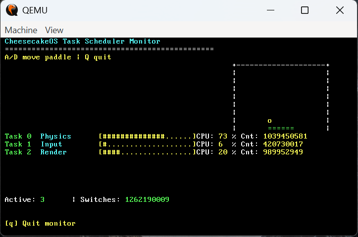
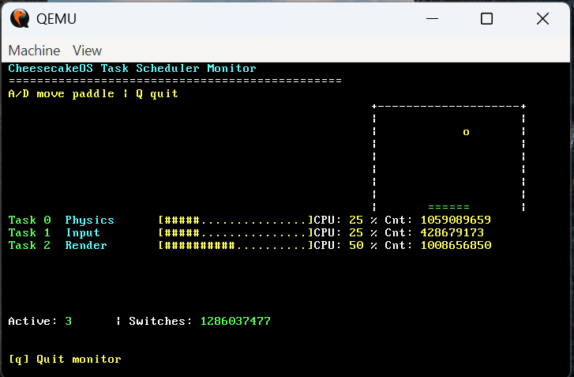
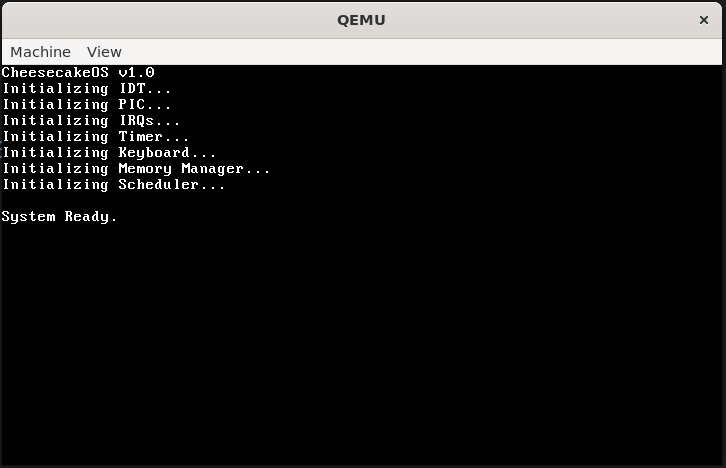
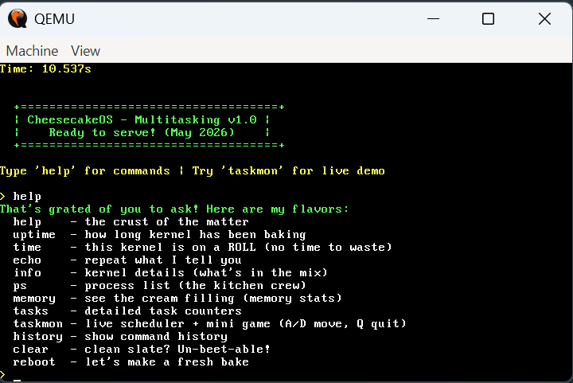
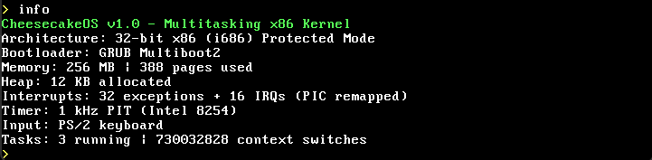
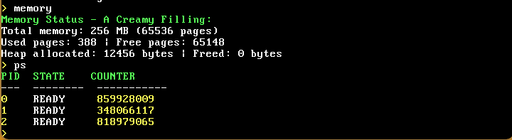

# 🍰 CheesecakeOS

> A 32-bit x86 operating system kernel built from scratch in C and x86 Assembly.

CheesecakeOS is a standalone operating system kernel that boots directly on x86 hardware through GRUB (Multiboot2). The project implements fundamental OS subsystems including interrupt handling, memory management, hardware drivers, shell interaction, and cooperative multitasking.

Originally developed as part of a Zoho systems programming assignment, CheesecakeOS evolved beyond the core requirements into a more complete educational kernel featuring a task scheduler, real-time task monitoring, and an interactive scheduler demonstration.

---

# Why This Project Matters

Modern software typically runs on top of operating systems that abstract away hardware complexity. CheesecakeOS explores what happens beneath that abstraction layer.

This project demonstrates how an operating system:

* Boots from bare hardware
* Handles CPU exceptions and hardware interrupts
* Manages physical and virtual memory
* Communicates with hardware devices
* Schedules and executes tasks
* Provides a command-line interface for system interaction

Every subsystem runs without relying on an underlying operating system.

---


# Build Instructions

## Prerequisites

Linux or WSL2:

```bash
sudo apt update && sudo apt install \
  build-essential nasm grub-pc-bin grub-common \
  xorriso qemu-system-x86
```

Verify:

```bash
gcc --version
nasm -v
qemu-system-i386 --version
```

---

## Build

```bash
make clean
make iso
```

---

## Run

```bash
make run
```
---

# Showcase

### Hero Demo: Live Scheduler Monitor + Interactive Demo

Run:

```text
help
info
taskmon
ps
memory
```

The `taskmon` command launches a real-time scheduler visualization showing:

* Multiple concurrent kernel tasks
* CPU usage distribution
* Task execution statistics
* Context switch counters
* Interactive paddle-and-ball demonstration

Controls:

```text
A / D = Move Paddle
Q     = Exit Monitor
```

### Demo Flow (60 Seconds)

```text
Boot CheesecakeOS
help
info
taskmon
ps
memory
```

This demonstrates nearly every major subsystem of the kernel:

* Drivers
* Interrupts
* Scheduler
* Memory Manager
* Shell
* Task Monitoring

---

# Key Metrics

| Metric         | Value                   |
| -------------- | ----------------------- |
| Architecture   | x86 (32-bit)            |
| Languages      | C + x86 Assembly        |
| Memory Model   | 256 MB                  |
| Page Size      | 4 KB                    |
| Physical Pages | 65,536                  |
| CPU Exceptions | 32                      |
| Hardware IRQs  | 16                      |
| Shell Commands | 11                      |
| Scheduler      | Cooperative Round-Robin |
| Demo Tasks     | 3 Concurrent Tasks      |

---

# Screenshots

## Task Scheduler Monitor



Live scheduler visualization displaying CPU usage bars, task counters, and scheduler statistics.

---

## Interactive Scheduler Demo



A paddle-and-ball demonstration executed by multiple kernel tasks to visualize scheduler behavior in real time.

---

## Boot Sequence



Kernel initialization sequence showing interrupts, drivers, memory manager, and scheduler startup.

---

## Shell Commands



Interactive shell with administrative and diagnostic commands.

---

## System Information



Kernel information including architecture, interrupt configuration, timer settings, and task statistics.

---

## Memory & Process Management



Memory allocation statistics and active task information exposed through shell utilities.

---

# Features

## Boot & Kernel

* GRUB Multiboot2 boot process
* Protected mode kernel
* Custom linker script
* QEMU support
* Clean kernel initialization pipeline

---

## Interrupt Handling

* Interrupt Descriptor Table (IDT)
* CPU exception handling (vectors 0–31)
* PIC remapping
* Hardware IRQ handling (vectors 32–47)
* Interrupt dispatching framework

---

## Drivers

* PIT timer driver (1 kHz)
* PS/2 keyboard driver
* Scancode translation
* Shift key support
* Key repeat support
* VGA text-mode interface

---

## Memory Management

* Bitmap-based physical page allocator
* 256 MB physical memory model
* Paging subsystem
* Identity mapping
* Heap allocator
* malloc/free support

---

## Shell

Available commands:

```text
help
uptime
time
echo
info
ps
memory
tasks
taskmon
history
clear
reboot
```

Capabilities include:

* System inspection
* Memory monitoring
* Task monitoring
* Command history
* Administrative controls

---

## Scheduler & Task Monitor

* Cooperative multitasking
* Round-robin scheduling
* Task statistics
* CPU usage tracking
* Context switch counters
* Live scheduler monitor
* Interactive scheduler demonstration

---

# Architecture

```text
┌──────────────────────────────────────────┐
│             Shell Interface              │
│   Commands • Diagnostics • Monitoring    │
├──────────────────────────────────────────┤
│      Scheduler & Task Management         │
│   Round-Robin • Statistics • Monitor     │
├──────────────────────────────────────────┤
│        Memory Management Layer           │
│   Physical Pages • Paging • Heap         │
├──────────────────────────────────────────┤
│         Interrupt Subsystem              │
│     IDT • Exceptions • IRQ Routing       │
├──────────────────────────────────────────┤
│             Device Drivers               │
│     PIT Timer • PS/2 Keyboard • VGA      │
├──────────────────────────────────────────┤
│             x86 Hardware                 │
└──────────────────────────────────────────┘
```

### Subsystem Overview

**Bootloader**

* GRUB loads the kernel via Multiboot2
* Control transferred to `ck_start`
* Kernel initializes core subsystems

**Interrupts**

* Full IDT implementation
* CPU exception handling
* PIC remapping
* Hardware IRQ processing

**Memory**

* Physical page allocation
* Paging setup
* Dynamic heap allocation

**Scheduler**

* Cooperative round-robin execution
* Task statistics collection
* Scheduler visualization

**Drivers**

* Timer services
* Keyboard input
* Text-mode output

---

# Design Decisions

| Decision     | Choice            | Reason                                              |
| ------------ | ----------------- | --------------------------------------------------- |
| Architecture | x86 32-bit        | Simpler paging model and excellent documentation    |
| Language     | C + Assembly      | Maximum hardware control with minimal abstraction   |
| Bootloader   | GRUB (Multiboot2) | Reliable boot process and industry-standard tooling |
| Emulator     | QEMU              | Rapid development and debugging                     |
| Kernel Type  | Monolithic        | Simpler subsystem interaction                       |
| Scheduler    | Cooperative       | Easier debugging and deterministic execution        |

---

# Beyond Assignment Requirements

The original assignment required:

* Kernel implementation
* Hardware drivers
* Memory management
* Basic shell

CheesecakeOS extends beyond those requirements through:

### Multitasking Scheduler

A cooperative scheduler capable of executing multiple independent kernel tasks.

### Task Monitoring System

Real-time monitoring utilities providing:

* CPU usage statistics
* Task counters
* Scheduler metrics
* Execution monitoring

### Interactive Scheduler Demonstration

A paddle-and-ball application implemented on top of the scheduler to demonstrate:

* Task execution
* Timer-driven updates
* Input processing
* Rendering coordination

### Advanced Shell Utilities

Additional commands for:

* Process inspection
* Memory inspection
* Task monitoring
* System diagnostics

---

# Project Structure

```text
cheesecakeOS/
├── boot/
│   ├── boot.asm
│   └── grub/
│       └── grub.cfg
├── src/
│   ├── kernel/
│   │   ├── ck_kernel.c
│   │   ├── shell.c
│   │   ├── scheduler.c
│   │   ├── scheduler.h
│   │   ├── kernel_tasks.c
│   │   ├── kernel_tasks.h
│   │   ├── visualizer.c
│   │   └── visualizer.h
│   ├── drivers/
│   │   ├── timer.c
│   │   ├── timer.h
│   │   ├── keyboard.c
│   │   ├── keyboard.h
│   │   ├── scancode.c
│   │   └── scancode.h
│   ├── interrupts/
│   │   ├── idt.c
│   │   ├── idt.h
│   │   ├── exceptions.c
│   │   ├── exceptions.h
│   │   ├── exceptions.asm
│   │   ├── pic.c
│   │   ├── pic.h
│   │   ├── irq.c
│   │   ├── irq.h
│   │   └── irq.asm
│   ├── memory/
│   │   ├── pmem.c
│   │   ├── pmem.h
│   │   ├── paging.c
│   │   ├── paging.h
│   │   ├── heap.c
│   │   └── heap.h
│   └── linker.ld
├── docs/
│   ├── overview.md
│   ├── srs.md
│   ├── architecture.md
│   ├── architecture-diagrams.md
│   └── devlog.md
├── Makefile
├── README.md
├── context.md
└── project-report.md
```

---

# Documentation

Additional documentation is available in:

* `docs/overview.md`
* `docs/srs.md`
* `docs/architecture.md`
* `docs/architecture-diagrams.md`
* `docs/devlog.md`

Topics include:

* Architecture decisions
* System design
* Development challenges
* Debugging notes
* Implementation details


---

# Implementation Status

| Component          | Status     |
| ------------------ | ---------- |
| Bootloader (GRUB)  | ✅ Complete |
| Kernel Entry       | ✅ Complete |
| Interrupt Handling | ✅ Complete |
| PIC Remapping      | ✅ Complete |
| PIT Driver         | ✅ Complete |
| Keyboard Driver    | ✅ Complete |
| Memory Allocator   | ✅ Complete |
| Paging             | ✅ Complete |
| Heap Allocator     | ✅ Complete |
| Shell              | ✅ Complete |
| Scheduler          | ✅ Complete |
| Task Monitor       | ✅ Complete |
| Interactive Demo   | ✅ Complete |

---

# Learning Notes

Coming from a competitive programming background, one of the most interesting aspects of this project was working without the safety net normally provided by an operating system.

A null pointer does not throw an exception.

A bad memory access does not produce a stack trace.

A mistake simply freezes the machine.

Building CheesecakeOS provided hands-on experience with memory management, interrupt handling, hardware communication, and kernel architecture that are rarely encountered in application-level development.

---

# Future Improvements

* Preemptive multitasking
* Full CPU context switching
* Filesystem support
* Mouse driver
* User-mode applications
* System call interface
* Virtual memory expansion
* Advanced process management

---

# References

* OSDev Wiki
* Intel® 64 and IA-32 Architectures Software Developer's Manual
* Multiboot2 Specification
* GNU GRUB Documentation
* QEMU Documentation
* The Little OS Book
* James Molloy's Kernel Development Tutorials

---

# Author

**Arjun Dasalkar**
