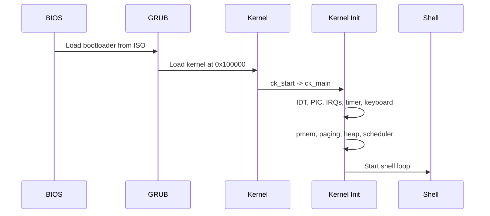
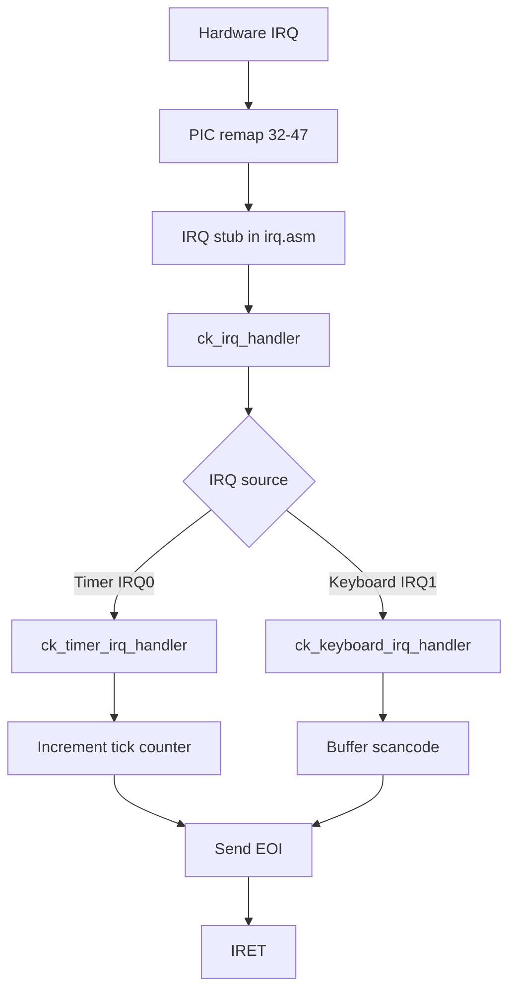
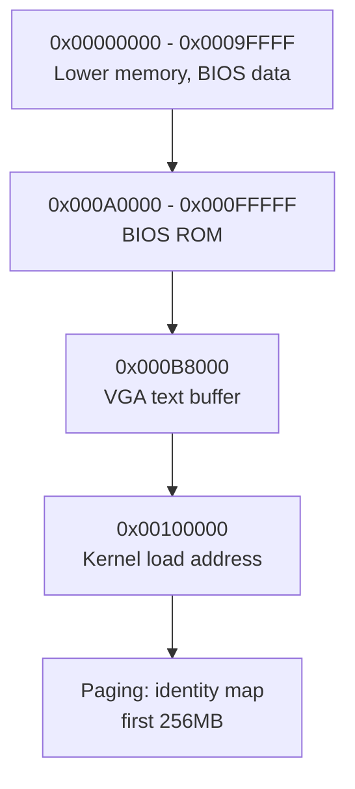
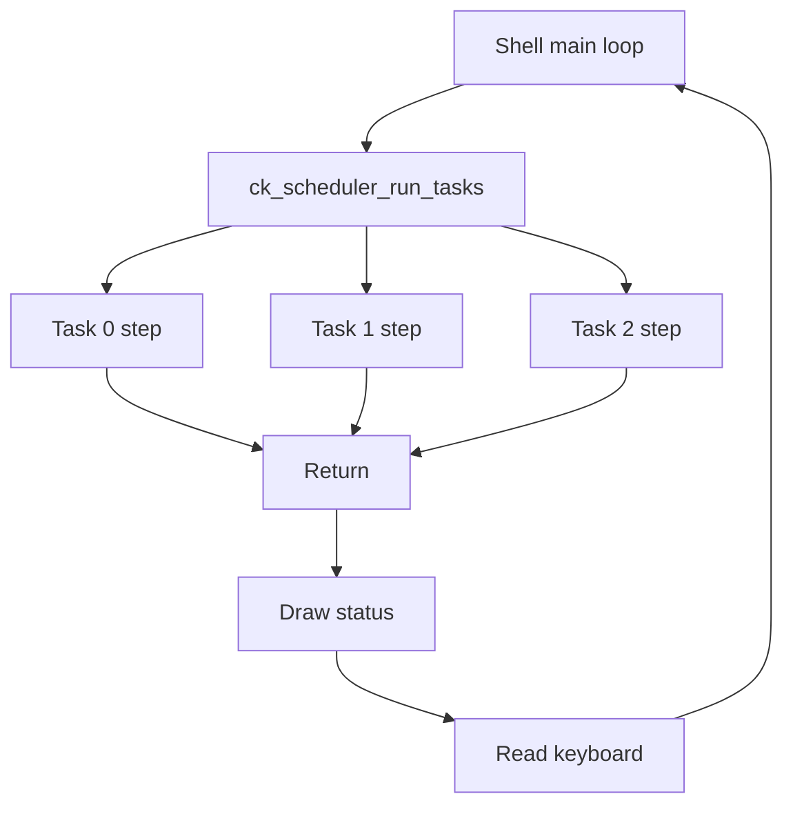
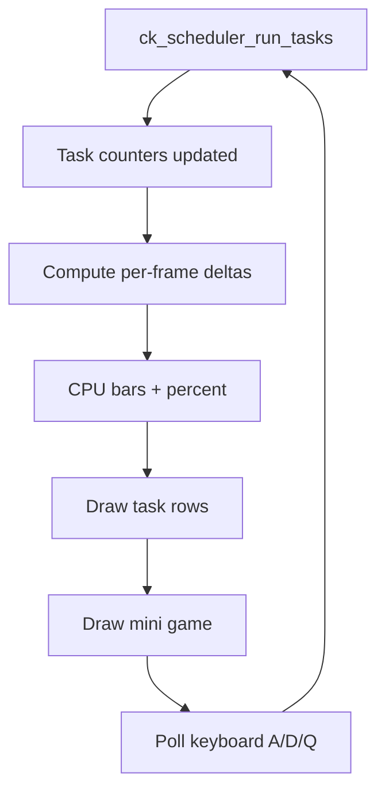
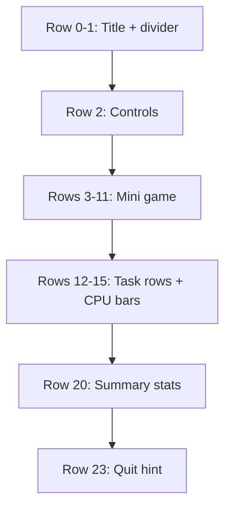

# CheesecakeOS - Architecture Diagrams

## Boot Sequence

## Interrupt Flow (IRQ 0-1)

## Memory Layout (Simplified)

## Scheduler Loop (Cooperative)

## Task Monitor Data Flow

## Task Monitor Layout

